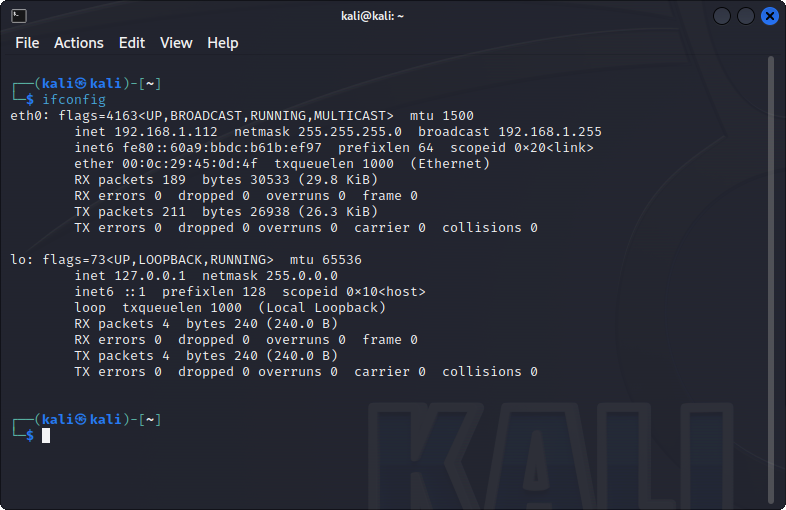
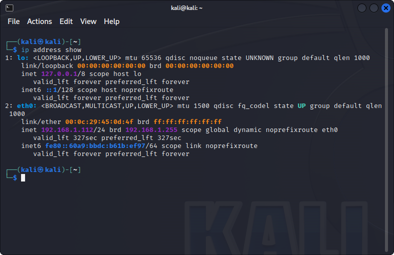
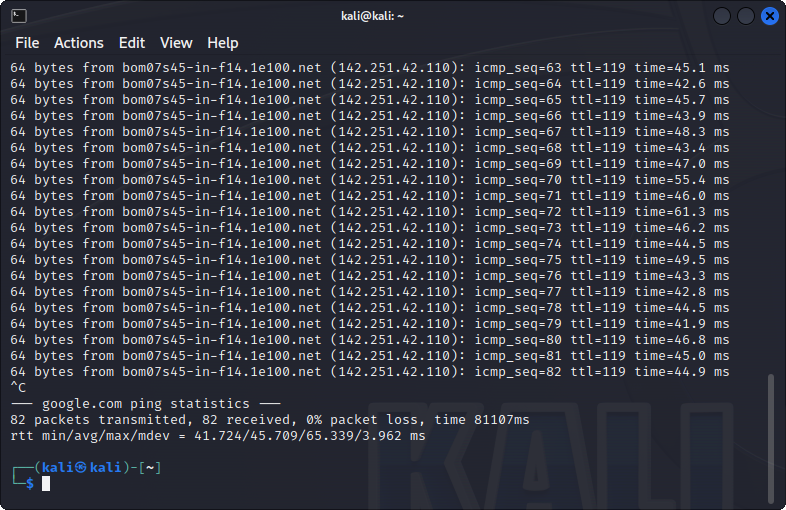

# 7 - Networking
 







5. **Network configuration**

```
ifconfig
```

```
ip address show
```




8. **Check network connectivity**

```
ping google.com
```

18. **Display network statistics**

```
netstat -tuln
```

19. **Secure Shell for remote login**

```
ssh user@hostname
```

20. **Netcat for network troubleshooting**

```
nc -vz host port
```